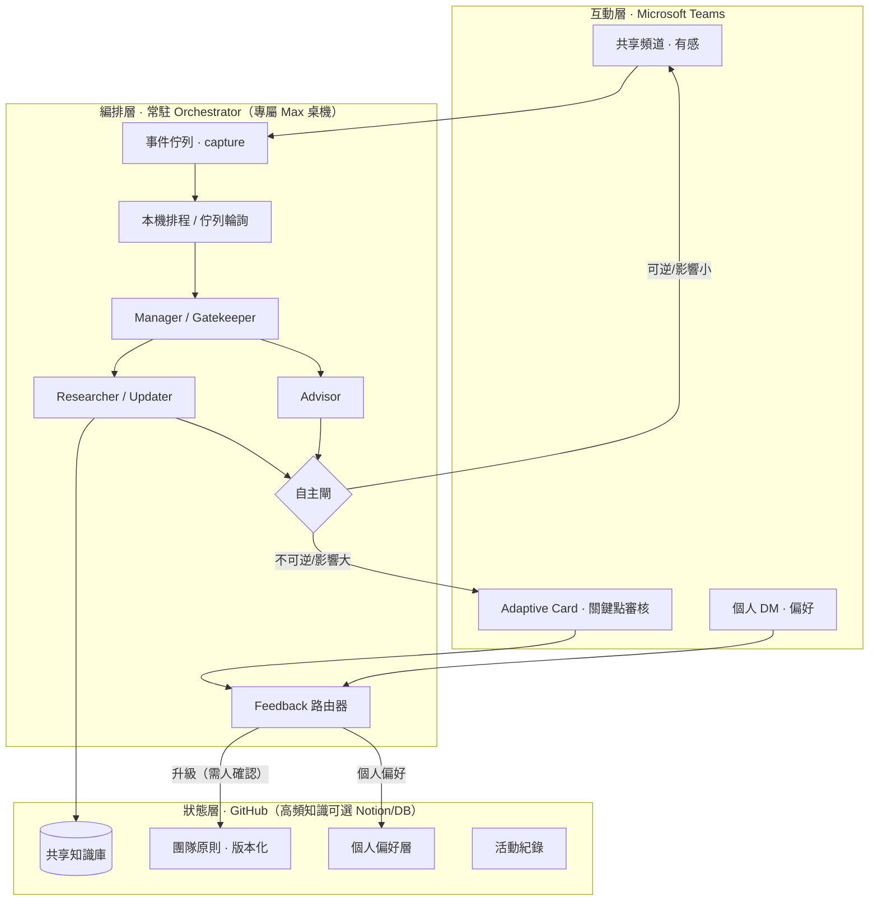
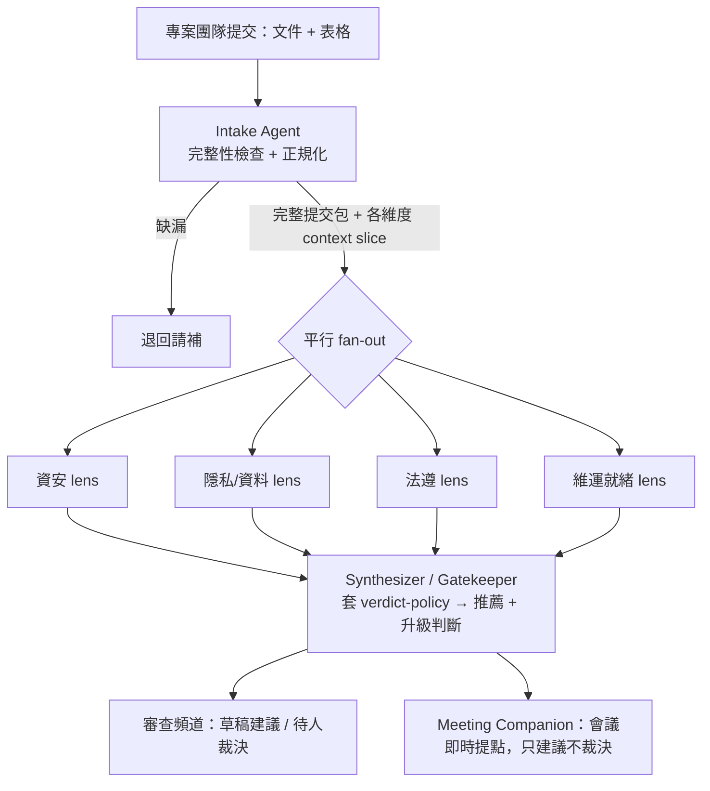

# Co-worker Agent Team — 架構與方案

> **文件狀態**：v2 工作設計 · 更新於 2026-06-26
> **一句話**：一組能跟真人協作、會自主行動、又把工作攤在看得見處的「數位同事團隊」。狀態與算力刻意解耦，計費與部署可各自獨立調整。
> **v2 變更**：(1) 常駐 orchestrator 改為一台專屬 Max 桌機；(2) skills 改為 thin shim + 執行時從 GitHub 取得動態內容；(3) 新增首個落地領域「專案上線審查團隊」（第 10 節）。

---

## 1. 目標與需求

要建一個 **Co-worker Agent**，甚至是一個完整的數位同事**團隊**：有人整理資料、有人定期更新資料與外部訊息、有人給意見、有人作為主管做最後確認。核心需求：

- **能跟真人互動**（Teams 群組 / 簡易介面）。
- **能吃人類 feedback 自主調整原則**（給反饋、改原則）。
- **運行要「有感」**，不能全藏在後台。
- **不額外部署前端站台** → 可 by 個人啟用。

這幾個需求彼此有張力，整份設計大半是在化解這些張力。

---

## 2. 核心設計原則（先記住這幾條，後面都從這推導）

1. **用現成協作平台當 rendering layer，不蓋網站。** Teams / GitHub 本身就是現成的呈現層——agent 的工作就是它發的訊息、開的 PR、更新的檔案。
2. **狀態與算力解耦。** 共享狀態放共用後端（GitHub），算力可中央、可 per-person。這條讓「共享一套腦、但帳各自算」可行，是最值得守住的一條線。
3. **高度自主 ≠ 看不見。** 「它自己做很多，但你隨時看得到、也隨時能喊停」。
4. **多 agent 照「工具邊界 / context 隔離 / 可平行 / 獨立第二雙眼」拆，不照職稱拆。**
5. **政策與知識要分開對待。** 被治理、改得慢、要留痕的「政策」與高頻變動的「參考知識」，架構角色不同，存放方式也不同。

---

## 3. 整體架構

三層：**互動層（有感＋互動）／ 編排層（算力與決策）／ 狀態層（共享大腦）**。



**唯一需要的「基礎設施」**：一台**常駐桌機**（跑 orchestrator）＋一個**極小的事件 capture**（serverless / webhook，只把 Teams 訊息丟進佇列）。兩者都不是前端站台，不違反「不另外架前端」。詳見第 5 節。

### 3.1 三顆基礎 agent 的分工（通用框架）

| Agent | 角色 | 為何獨立 |
|---|---|---|
| **Researcher / Updater** | 整理資料 + 定期更新外部訊息 | 唯一有外部（web）access 與寫入權；排程＋隨叫隨到都跑；雜訊不該污染別人 context |
| **Advisor** | 給意見 / 判斷 | 只讀共享知識＋個人偏好；乾淨 context；獨立的第二雙眼 |
| **Manager / Gatekeeper** | 彙整、判斷關鍵點、把升級包成審核 | 它的工作就是分辨「自動進行」與「問人」之間的那道閘 |

> 這是**通用骨架**。具體領域（如第 10 節的審查團隊）會把它實例化成領域專屬的 agent，但拆分理由不變。

### 3.2 兩道閘（整個系統最關鍵的兩個機制）

**自主閘（Autonomy Gate）** — 決定「能不能自己做」，用 **可逆性 × 影響範圍** 兩軸：

- **可逆 且 影響小** → **自動執行**（讀資料、查外部、分析、寫工作筆記、po 摘要到頻道）。
- **不可逆 或 影響大** → **停下問人**（PR 或 Adaptive Card）：對外發信/訊息、改 source-of-truth、寫進共享原則、花錢、碰真實客戶、發出正式裁決。
- 配套：共享頻道持續用**摘要級**顯示它在做什麼，讓人能在走到關鍵點**之前**就介入。
- 規則本身被治理、版本化，見 `principles/autonomy-gate.md`。

**Feedback 路由器（Feedback Router）** — 決定「一條回饋該改誰」：

- 判斷是**共享層**修正（全團隊受惠）還是**個人偏好**（只有你要這樣）。
- 寫進共享層（升級）**需人確認**；只改個人 overlay 則自動。

---

## 4. 記憶模型：混合（共享 + 個人）

- **共享知識庫**：全員共用，知識集體累積。
- **團隊原則（版本化）**：被治理的政策，含關鍵點判準。
- **個人偏好層**：per-user overlay。

**讀法依表面而定**：服務共享頻道用**共享 context**（公開場合不套個人偏好）；個人 app 互動時**疊上該使用者的 overlay**。同一個狀態層，兩種讀法。

---

## 5. 運算與計費模型

**前提：訂閱 ≠ API，是兩個分開的產品**——claude.ai 訂閱（Pro/Max/Team/Enterprise）不含 Console 的 API 使用。

### 5.1 常駐 orchestrator ＝ 一台專屬 Max 桌機（本專案選定）

常駐那段（監聽 Teams、跑排程）跑在**一台專屬、永遠 awake 的桌機**上，登入一個**專屬 Max 訂閱帳號**，由本機排程器（Windows Task Scheduler / cron / launchd）以該帳號身份程式化叫起 Claude Code / Cowork。

**可行的理由**：Claude Code 可用 Max 訂閱登入、且有 CLI/SDK 可被程式化觸發 → 常駐這段可走訂閱、不走 API。

**必須知道的取捨**：

- **訂閱有用量上限**：但「監聽」本身不耗 token，只有實際處理/推理才算；只要排程掃描＋處理訊息的 model 呼叫量落在 Max 額度內就行，量大會被 throttle。
- **非官方支援的自動化路徑**：把消費訂閱當 24/7 無人值守後端是灰色地帶（訂閱本意是個人互動式使用）；受支援的自動化是 API。需自行承擔條款與穩定性風險。
- **桌機是單點故障**：會睡眠、session 可能過期要重新登入、會當機、無受管自動重啟 → 要自己補 watchdog 自動重啟、keep-awake、重新認證處理。

**讓它穩很多的 pattern——把「接事件」與「做事」拆開**：

- 一個極小的 serverless 函式 / Teams outgoing webhook 只負責**接訊息、丟進佇列**（佇列可以就是：開一個 GitHub issue／寫一列 Notion／丟一個檔案）。這段永遠在線且便宜。
- 桌機**輪詢佇列**取工作。桌機掛了，訊息不會掉。

**連帶調整**：因為 orchestrator 跑在訂閱上，**排程器從 GitHub Actions 搬到桌機本機**（Actions 走 API key、碰不到訂閱）。但 **dashboard 那支 Action 留在 Actions**——它只用 `GITHUB_TOKEN` 讀狀態、不呼叫 model，沒差。

> 老實說，若可靠性優先，中央 API key 對「常駐」這段其實更穩、且成本很低（只是監看＋彙整）。此處記錄的是「用訂閱省 API 帳」這條路最穩的版本；架構刻意解耦，之後要切回 API 只動這一層。

### 5.2 互動 / per-person ＝ 各自的訂閱

深度來回、臨時分析，以本人身份跑在本機 **Claude Code / Cowork**，token 落在各自方案上。

- 沒辦法讓一個中央服務「假扮」每個人的訂閱：一個中央服務 = 一把 key/一個帳 = 一筆帳。
- 若在意「成本公平分攤」：用 **中央 API + per-user 用量歸因 + 每人預算上限 + 內部 chargeback** 更乾淨。
- 合規的「個人訂閱」路徑是每人跑**自己的**本機 runtime（以本人身份）。

---

## 6. 三條核心流程

### 6.1 排程 trigger（桌機本機排程）

1. 桌機排程器（如 08:00）觸發，以 Max 帳號叫起 worker。
2. 啟動 **Researcher**，context = 共享原則 + 共享知識庫（**不帶個人 overlay**）。
3. 抓外部資訊，對知識庫**去重**，只留新的/有變動的。
4. 交 **Manager** 過自主閘：可逆→**自動**（po 摘要 + append 知識庫）；掃到「需動作」=關鍵點→**Adaptive Card** 等人。

### 6.2 user trigger — Teams @mention（capture → 佇列 → 桌機）

1. 有人在頻道 @團隊；capture webhook 把事件丟進佇列。
2. 桌機輪詢取得 → Manager 判斷查詢/建議 → 委派 Researcher / Advisor。
3. 用**共享 context**（公開頻道不套個人偏好）產出。
4. 過閘：在頻道回答=可逆→**自動 po**；附帶副作用→Adaptive Card。

### 6.3 個人互動（走個人訂閱）

> **⚠️ 已修訂(審查領域)**：此專案後來**拿掉「走個人訂閱」這條路**——全部執行集中在中央主機。
> 委員的回饋改走 **Slack 1:1 → 中央 feedback store → 排程 feedback-synthesis 彙整成 skill 修改提案(PR)→ 人覆核 merge**。
> 不再有「個人 overlay / token 走個人訂閱」。下面原文保留為設計沿革。詳見 `CLAUDE.md`「Feedback 迴圈(中央化)」。

1. 開**自己的 Cowork / Claude Code**（訂閱登入），已配置同一套 team skills + 連狀態層。
2. 多輪深入分析，讀**共享知識 + 你的偏好 overlay**；**這段 token 全走你的訂閱**。
3. 你的修正 → **Feedback 路由器**：判團隊級→**提案升級（需確認）**；判個人→**只更新你的 overlay**。
4. 分享成果；對外或寫 source-of-truth **仍過閘**。

### 6.4 四個不變量

- **表面決定 context**：頻道用共享、個人 app 疊 overlay。
- **兩道閘各司其職**：自主閘管「能不能自己做」、路由器管「回饋改誰」。
- **一致性靠共享原則**：桌機 daemon 與每個人的 Cowork 都讀**同一份版本化原則**；個人修正能（經確認）回流影響中央。
- **skills 放兩處、指向同一套 playbook**：見 7.2。

---

## 7. 狀態層：GitHub

**為何 GitHub**：原生具備 修改 / merge / 版本歷史 / blame，記錄「誰、在何時、改了什麼」——直接解掉「高自主系統需要可審計、可回滾的治理政策」。

**分界（重要）**：

- **天生適合 git**：團隊原則、**關鍵點判準（自主閘規則）**、agent system prompt、skills/playbook、review rubric、verdict policy。改得慢、要審、要留痕。
- **放 git 會卡**：高頻更新的共享知識庫、活動 log、per-user 暫存。git 是離散、被審核的 commit 模型，不是高頻串流，且沒有查詢/索引層。
- → **混合**：git 放「大腦設定」，高頻知識留 Notion / 輕量 DB（或在 git 用「批次 commit + 衍生索引」硬做）。

**換軌送的兩個原生升級**：

1. **PR = 人類確認閘的原生版。** 凡改政策/知識，agent 開 PR（描述＝推理、diff＝改動、review＝回饋、merge＝決策）。配 **CODEOWNERS + branch protection** 強制「原則類變更必須人 merge」。
2. **GitHub Actions = dashboard 與輔助自動化的代管 compute。**（注意：跑 model 的 daemon 已搬桌機；Actions 只用於不需 model 的事，如 dashboard。）

**用決策類型選確認介面**：治理 / 知識變更走 **PR**；時效性、非工程的操作型確認走 **Adaptive Card**。

### 7.1 建議的 repo 結構

```
co-worker-team/
  CLAUDE.md                  ← Claude Code 的專案定向（先讀這個）
  IMPLEMENTATION_PLAN.md     ← 分階段實作計畫
  README.md / DASHBOARD.md   ← 自動生成的 live 狀態板
  principles/
    team-principles.md
    autonomy-gate.md         ← 關鍵點判準（版本化、PR 審核）
  contracts/
    finding.schema.json      ← review lens 的結構化輸出契約
    verdict-policy.md        ← findings → 裁決 + 哪些要人簽
  rubrics/                   ← 各維度審查 rubric（動態內容，被 skill fetch）
    review-security.md
    review-privacy.md
    review-legal.md
    review-ops.md
  agents/                    ← 各 agent 的 system prompt
  skills/
    _lib/github_fetch.py     ← 共用 helper：執行時從 repo 取動態內容
    review-security/SKILL.md ← thin-shim 範例
    ...
  knowledge/                 ← 參考知識（高頻 → 可選擇留 Notion）
  preferences/<user>.md      ← per-user overlay
  activity/log.jsonl         ← 活動 feed（批次 append）
  orchestrator/              ← 桌機常駐程式（排程器 + 佇列輪詢 + 編排）
  capture/                   ← Teams → 佇列 的極小 webhook
  .github/
    workflows/dashboard.yml  ← 不需 model 的 dashboard 自動更新
    CODEOWNERS
```

### 7.2 Skills：thin shim + 執行時從 GitHub 取得

把 skill 拆成兩層：

- **Skill 本體＝穩定的 shim（很少改）**：只放「去 repo 讀哪幾個檔、怎麼讀、產出什麼格式」。
- **動態內容＝住在 GitHub（常改）**：`principles/`、`autonomy-gate.md`、`rubrics/`、`verdict-policy`、playbook。執行時 fetch 最新版。

於是**改 rubric／原則＝開一個 PR，merge 後所有人下一次跑就吃到新版，完全不用重發 skill**。精度：

- 私有 repo 要 auth（唯讀 fine-grained PAT 或 GitHub App token；公開 repo 可直接 raw）。
- 讀 `main`（已被治理、merge 後＝你要的版本）；要更穩可 pin 到 release tag／commit，避免讀到改到一半的中途狀態。
- 加快取／TTL：政策檔很小、可每次讀；知識庫很大、應「需要時才查」而非每次全抓。
- Rate limit（授權 token 約 5000/hr）對「讀幾個檔」綽綽有餘。

若用 Anthropic 的 Skills 功能，`SKILL.md` 就是這個 shim，裡面 bundle 一支 helper script 打 GitHub API——完全相容。範例見 `skills/_lib/github_fetch.py` 與 `skills/review-security/SKILL.md`。

---

## 8. 展示 / Dashboard（完全不需要另外的 server）

**GitHub Actions 是 GitHub 代管的 compute，不是你要維護的 server。** 自動更新的 dashboard =「一個 Action 在每次有動靜時把現況算出來、寫回 repo / 推上 Pages」。

| 層級 | 做法 | 私密性 |
|---|---|---|
| **L1 · `DASHBOARD.md`** | Action 算完把 markdown commit 回 repo；GitHub 原生 render（含 Mermaid） | **完全私有**；最簡單 |
| **L2 · GitHub Pages** | Action **預烤** `data.json`，靜態頁讀自己的 data.json 畫圖；瀏覽器**免 token、不打 API**、無 server | Pages 站台**公開**（即使 repo 私有） |

部署用官方三件組：`actions/configure-pages` → `actions/upload-pages-artifact` → `actions/deploy-pages@v4`。

**隱私點**：**Pages 站台即使 repo private 也公開在網路上**。敏感 repo → 要嘛只用 **L1 DASHBOARD.md**（完全私有），要嘛確保 **data.json 只放消毒過、可公開的數字**。

**已產出檔案**（在本交接包內）：`.github/workflows/dashboard.yml`、`scripts/generate_dashboard.py`、`site/index.html`、`site/data.json`。範例 metric（追蹤數、待人類決策、原則變更、掃描成功率）對應到審查領域時，可換成「審查中專案數、待人簽裁決、merged rubric 變更、各 lens 健康度」。

---

## 9. 待辦 / 下一步

實作交給 Claude Code（見 `CLAUDE.md` 與 `IMPLEMENTATION_PLAN.md`）。主要工作：

- [ ] **桌機 orchestrator**：本機排程器 + 佇列輪詢 + 編排；watchdog / keep-awake / 重新登入處理。
- [ ] **capture webhook**：Teams outgoing webhook → 佇列（issue / Notion / 檔案）。
- [ ] **review pipeline**：Intake → 平行 review lenses → Synthesizer（套 verdict-policy）。
- [ ] **rubrics + skills**：先做 3–4 個真正會 gate 上線的維度；skill 走 thin-shim fetch。
- [ ] **契約**：`finding.schema.json` 落地 + 各 lens 輸出驗證。
- [ ] **`verdict-policy` 判準表**：哪些裁決必須人簽（領域自主閘）。
- [ ] **Teams 整合**：Adaptive Card 人簽、頻道摘要（有感）、Meeting Companion。

---

## 10. 首個落地領域：專案上線審查團隊

**目標**：一個審查 agent team，審查要上線的專案——審核專案團隊提供的文件 / 填寫的表格，對裁決給出建議，並在跨部門上線會議時適時給出建議。

### 10.1 怎麼拆（用 context，不用 persona）

> **拆「Agent」的理由是 context 隔離 / 工具邊界 / 可平行 / 需要獨立的第二雙眼；拆「Skill」的理由是可重用的能力模組。**
> 結論：**Agent 少（各自有獨立 context 的執行者），Skill 多（被載入的能力）。** 這就是效率的答案——「一人一工」之所以爛，是拿 persona 在分；正確的是拿**工作的接縫**在分。

這個領域的天然接縫＝一條 pipeline + 一個平行展開：



### 10.2 四顆 Agent（各自為何獨立）

| Agent | 做什麼 | 為何是獨立 agent |
|---|---|---|
| **Intake** | 解析提交、檢查完整性、正規化成標準包、切出各維度 context slice | 工具邊界不同（文件解析 / 表單 schema 驗證）；判斷少、結構多，適合便宜模型 |
| **Review-lens（平行 N 顆）** | 每顆只看**一個維度**的 criteria + 提交的相關切片，產結構化 findings | **context 隔離**是最大價值（資安與法遵 criteria 互不污染）；可**平行**；每顆是**獨立的一票** |
| **Synthesizer / Gatekeeper** | 彙整各維度、套 `verdict-policy`、產推薦、**決定哪些要交人** | 不同判斷角色 + 它是自主閘的執行點（Manager 的對應） |
| **Meeting Companion** | 在跨部門會議即時提點 / 答問 | **不同表面 + 即時性 profile**；互動式，跟 async 審查分開 |

### 10.3 Skills（可重用、住 GitHub、依 7.2 fetch）

- `intake-completeness`：必備文件清單 + 表單欄位驗證規則 + 「缺什麼」輸出格式。
- `review-<dimension>`（`review-security` / `review-privacy` / `review-legal` / `review-ops`…）：該維度 rubric + 要問的問題 + finding schema。**先做真正會卡上線的 3–4 個**，之後再加。
- `verdict-policy`：怎麼把各維度 findings 權衡成 go / no-go / 帶條件，以及**哪些裁決必須人簽**（領域自主閘判準）。
- `meeting-brief`：怎麼把審查結果變成會議可用 brief、怎麼即時答問（什麼該講、什麼留給人）。

> **Skill 多不增加 runtime 成本**（只是被載入的內容，不是在跑的 process）；真正同時在跑的 agent 很少（Intake → fan-out K 顆 → Synthesizer → 會議）。這就是為什麼這樣拆比「一人一工」有效率。

### 10.4 自主閘對應到這個領域（重要的安全框架）

- **自動（可逆/低風險）**：讀提交、跑各維度分析、把**草稿建議 / brief** 貼到審查頻道、請專案團隊補缺漏欄位。
- **關鍵點（必須人簽）**：發出真正 gate 住上線的 **go/no-go 裁決**、**否決**一個專案、任何專案團隊會當成「官方決定」的東西。
- **核心原則：Agent team 給推薦，人（審查委員會）做裁決。** AI 不該是「能不能上線」的最終權威。Meeting Companion 在會議裡也一樣——給建議與證據，人決定。

### 10.5 各塊跑在哪（把三個調整接起來）

- **async 審查**（Intake → lenses → Synthesizer）＝排程/觸發型 → 跑在**中央 Max 桌機**（5.1）。專案一提交就觸發。
- **Meeting Companion** ＝即時、量較大 → (a) 跑在中央桌機、貼進 Teams 會議聊天，或 (b) 由主持會議的人從**自己的 Cowork** 叫起。看額度想落在中央還是個人。
- **個別審查委員深挖某 finding** → 用**自己的訂閱 Cowork**（5.2 / 7.2），載入同一套 review skills 從 GitHub 拿——跟中央讀的是同一份 rubric。

### 10.6 效率提醒

- fan-out 是**平行**的，N 個維度不是 N 倍慢、是「最慢那顆」的時間。
- 用**分層模型**：Intake / 完整性用便宜快的；各維度深審 + 合成用強的。
- **別過度拆**：一個沒有獨立 criteria、或永遠審不出東西的 lens 就該併掉。

---

## 附錄：名詞對照

- **自主閘 / Autonomy Gate**：用「可逆性 × 影響範圍」決定自動執行或停下問人的判斷點。
- **Feedback 路由器 / Feedback Router**：決定一條回饋寫進共享層（需確認）或個人 overlay。
- **狀態與算力解耦**：共享狀態（GitHub）與算力（桌機 Max 訂閱 / 個人訂閱 / 或中央 API）分離，計費與部署可獨立調整。
- **thin shim skill**：skill 只放「去哪讀、怎麼讀、產什麼格式」，動態內容住 GitHub、執行時 fetch。
- **review lens**：只負責單一審查維度、有獨立 criteria 與乾淨 context 的 agent。
- **有感**：團隊的工作以摘要級持續顯示在共享表面，人可隨時看見並介入。
